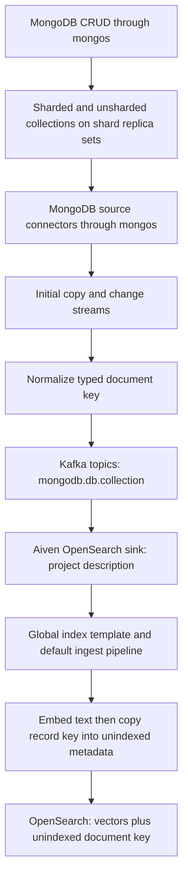
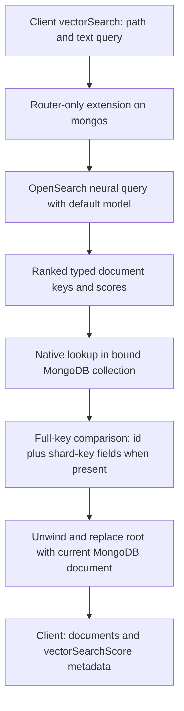

# Architecture

See [README](README.md) for runnable commands and [SYNC](SYNC.md) for connectors.

## Synchronization

## Aggregation pipeline

## Extension and SDK

The separate `opensearch_mongos_extension` library registers only `$vectorSearch`,
with `hostType: router`, `requiresInputDocSource: false`, and
`providedMetadataFields: ["vectorSearchScore"]`. It does not use
`$_internalSearchIdLookup`, and no extension is loaded by a shard or the CSRS.

The SDK's post-bind distributed-plan callback knows the collection namespace.
It appends a native `$lookup`, `$unwind`, and `$replaceWith` on the merger (mongos).
The generator emits no collection input; the SDK adds an always-false shard
predicate rather than scanning the collection to drive the source stage.
No MongoDB server changes are needed.

The OpenSearch `_id` is decoded from canonical Extended JSON back into BSON.
Candidates carry `_id` plus an array of all document-key name/value pairs.
The native lookup joins on `_id`, then compares every key field against the
candidate. Dotted paths are read one component at a time; missing shard-key
fields normalize to null. This prevents documents sharing an `_id` on different
shards from being confused. It also preserves ObjectId/Int64 values without
turning them into strings. Hashed shard keys use their **original values**, not
the MongoDB hash output.

Unsharded collections use the same path, with document keys containing only
`_id`. Native lookup then compares only `_id` and returns documents from the
owning shard through mongos; no shard-key predicate is invented. The demo and
integration suite include an unsharded collection alongside the sharded ones.

The generic comparison may scatter across shards. Full-key correctness is
distinct from targeted routing; the latter is not promised by this PoC.
Lookup reads the current MongoDB document, so a Mongo-only `title` update is
visible even if OpenSearch has not caught up. Deleted/missing candidates are
omitted. Stale candidates can therefore produce fewer than `limit` documents;
there is no iterative over-fetch in this version.

Native stages preserve score metadata. It is exposed with
`{$meta: "vectorSearchScore"}` and is not inserted into the MongoDB document
unless the client requests it. The extension forwards text to OpenSearch's
neural query; neither embeddings nor model IDs are sent by the MongoDB client.

## Model and default pipelines

During startup, the shared
[`register-opensearch-model.py`](../opensearch/scripts/register-opensearch-model.py)
registers and deploys
`huggingface/sentence-transformers/paraphrase-MiniLM-L3-v2`, version `1.0.2`, ONNX,
with 384-dimensional embeddings. It verifies prediction and writes the deployed
model ID to the model volume.

The shared [`setup-opensearch.py`](../opensearch/scripts/setup-opensearch.py) reads
this ID and this project's three configuration files:

- [Ingest pipeline](config/opensearch-ingest-pipeline.json): vectorizes every
  projected text field and removes raw text. The final script copies `ctx._id`
  into `__mongodb.documentKey` as a canonical Extended JSON string. Metadata is
  created after `text_embedding`, which would otherwise strip nested string
  values. Any stale incoming `__mongodb` object is removed before embedding.
- [Search pipeline](config/opensearch-search-pipeline.json): sets the default model
  with `neural_query_enricher`, so aggregation queries do not need a model ID.
- [Index template](config/opensearch-index-template.json): matches `mongodb.*`,
  sets both default pipelines, maps embeddings as 384-dimensional Lucene HNSW
  cosine vectors, and maps `__mongodb` as an object with `enabled: false`.

Indexes and vector mappings are created automatically on first sink writes.
MongoDB only has the normal indexes needed for sharding, not search/vector indexes.

The reserved `__mongodb` object is inspection metadata, not an embedding input
or lookup predicate. Its `documentKey` string exactly matches OpenSearch `_id`,
including formatter whitespace and BSON type wrappers. Dotted names stay inside
the serialized key rather than being interpreted as OpenSearch field paths.
The extension continues to decode candidates from OpenSearch `_id` itself.

## Failure handling

Extension options contain only comma-separated OpenSearch endpoints. The demo
has one; multiple endpoints are tried in configured order with a two-second
HTTP timeout per attempt. Interrupts are checked between attempts. When all
endpoints fail, aggregation fails rather than returning an empty successful result.
Malformed candidate keys and partial/timed-out OpenSearch responses are errors.
There is no background heartbeat/circuit breaker in this version; an unreachable
endpoint can still add its bounded timeout to each query.

The single-node demo does not prove HA. Kafka Connect distributed workers can
reassign connector tasks, Kafka and OpenSearch can run replicated clusters, and
the extension accepts several endpoints. Ordering/replay assumptions are
described in [SYNC](SYNC.md). Shard-key mutation and resharding are not supported.
