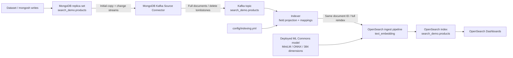
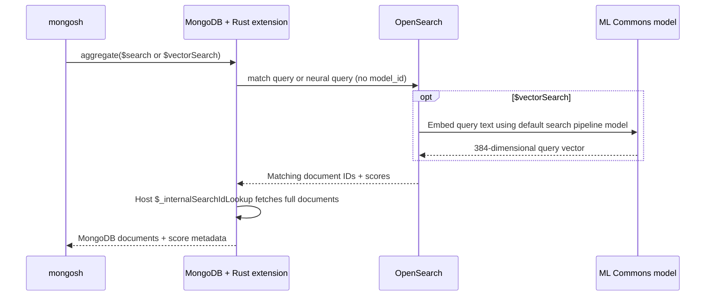

# OpenSearch Architecture

For build, startup, and MongoDB/OpenSearch demo commands, see [README.md](README.md).
For connector configuration, see [SYNC.md](SYNC.md). Consumer HA/FT details are
in [INDEXER.md](INDEXER.md).

## Architecture

MongoDB is the source of truth. Synchronization goes from MongoDB to OpenSearch;
search requests go through the Rust SDK for MongoDB Extensions. Search/vector
indexes live in OpenSearch. This Docker demo uses single-node services without
TLS/auth or HA.

## What Startup Configures

### Kafka and the Indexer

Kafka buffers MongoDB changes between the source connector and the OpenSearch
indexer. [Dockerfile.connect](Dockerfile.connect) installs the connector into the
Kafka Connect image; [docker-compose.yml](docker-compose.yml) starts the broker,
Connect worker, and registration service.

[indexer/indexer.py](indexer/indexer.py) is the Kafka-to-OpenSearch consumer. It
creates mappings and pipelines, projects configured fields, and writes or tombstones
OpenSearch documents. It is separate from both the source connector and the
MongoDB query extension. Its processing and scaling guarantees are described
in [INDEXER.md](INDEXER.md).

### OpenSearch Mappings

After model setup, [indexer/indexer.py](indexer/indexer.py) reads
[config/indexing.yml](config/indexing.yml) and creates index
`search_demo.products` with these mappings:

| Field | OpenSearch type |
| --- | --- |
| `_mongo_namespace` | `keyword` |
| `_sync_deleted` | `boolean` |
| `_sync_topic_id` | `keyword` |
| `name` | `text` |
| `description` | `text` |
| `description_embedding` | `knn_vector`, dimension `384`, HNSW / Lucene / cosine similarity |
| `category` | `keyword` |
| `price` | `float` |
| `inStock` | `boolean` |
| `updatedAt` | `date` |

The `search` tag creates a text field. The `vectorSearch` tag also creates
`<field>_embedding`. `filter` and `sort` fields use their configured scalar types.
Only configured fields are sent to OpenSearch, plus namespace and sync metadata.
MongoDB `_id` becomes the OpenSearch document ID.

The indexer consumes Kafka messages and fully reindexes each inserted, replaced,
or updated document. A delete creates a persistent fence document, excluded from
both search stages. Kafka offset-based external versions reject stale writes;
the index's `_meta` binds it to the Kafka topic UUID and configuration.

### Embedding Model and Defaults

[scripts/register-opensearch-model.py](scripts/register-opensearch-model.py)
registers and deploys the OpenSearch-provided model:

- Name: `huggingface/sentence-transformers/paraphrase-MiniLM-L3-v2`
- Version: `1.0.2`
- Format: `ONNX`
- Output: `384`-dimensional embeddings

The script runs in the `opensearch-model` container, waits for registration and
deployment to complete, checks inference, and writes the model ID to a shared
Docker volume. Inference runs locally in OpenSearch ML Commons.

The indexer reads that model ID and creates two pipelines:

| Pipeline | Purpose |
| --- | --- |
| `search_demo-products-auto-embed` | Uses `text_embedding` to generate `description_embedding` from document text. |
| `search_demo-products-default-neural-model` | Uses `neural_query_enricher` to supply the default model ID for queries on `description_embedding`. |

When creating the index, the indexer attaches them as
`index.default_pipeline` and `index.search.default_pipeline`. Consequently,
documents receive vectors automatically, and `$vectorSearch` queries only need
`path` and query text. The model is configured on the OpenSearch side, rather
than passed in MongoDB aggregation arguments.

### MongoDB Extension

[Dockerfile](Dockerfile) builds and loads one Rust extension that registers
both `$search` and `$vectorSearch`. Its OpenSearch endpoints are configured
under `extensionOptions` in `/etc/mongo/extensions/opensearch.conf`.

The extension sends queries to index `search_demo.products`, receives IDs and
scores, and delegates full document lookup to MongoDB's
`$_internalSearchIdLookup`. Scores are available through `$meta` projection.
These are PoC stage shapes; they do not implement the full Atlas Search syntax.

The consumer supports active-standby, but the single-node infrastructure is not
highly available. See [INDEXER.md](INDEXER.md) for guarantees and remaining limits.
