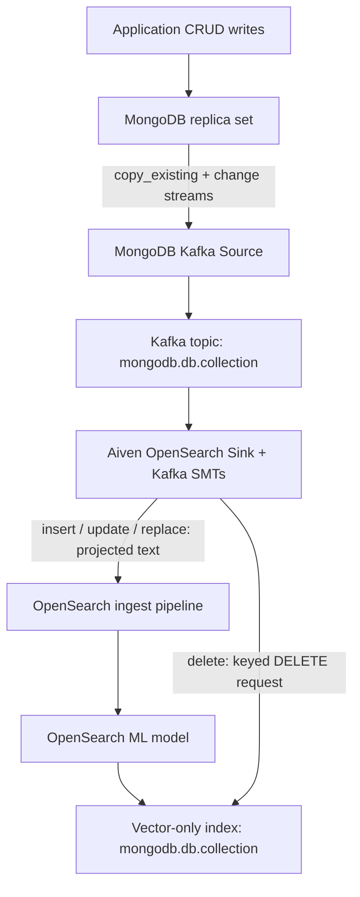
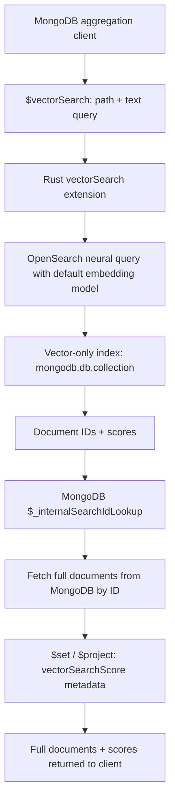

# Vector Search Architecture

See [README.md](README.md) for commands, [SYNC.md](SYNC.md) for configurations,
and [CONNECTOR.md](CONNECTOR.md) for ordering and recovery limits.

## Components

### CRUD Synchronization

DELETE requests go directly from the sink to OpenSearch, bypassing ingest.
There is one Connect worker, one topic partition, one source task, and one sink
task. There is no custom Kafka consumer or sink script.

### Aggregation Pipeline

## Startup and Automatic Mappings

During image build, [Dockerfile.connect](Dockerfile.connect) installs the MongoDB
source connector and pinned Aiven OpenSearch sink version **3.2.0**.
[docker-compose.yml](docker-compose.yml) initializes the MongoDB replica set,
loads the dataset, and creates `mongodb.search_demo.products` with one partition.

[scripts/register-opensearch-model.py](scripts/register-opensearch-model.py)
registers and deploys **huggingface/sentence-transformers/paraphrase-MiniLM-L3-v2**,
version **1.0.2**, format **ONNX**, dimension **384**. OpenSearch downloads the
open pretrained model and its inference runtime on first setup. A prediction
smoke test checks the dimension before writing the resolved ID to `/model/model-id`.
The setup script adjusts ML memory/allocation settings for this disposable demo;
these relaxed settings are not production recommendations.

After model registration, [scripts/setup-opensearch.py](scripts/setup-opensearch.py)
reads that ID and installs these shared resources:

| Resource | Configuration | Role |
| --- | --- | --- |
| `mongodb-auto-embed` ingest pipeline | [opensearch-ingest-pipeline.json](config/opensearch-ingest-pipeline.json) | Converts every projected text field into its own vector and removes text. |
| `mongodb-default-model` search pipeline | [opensearch-search-pipeline.json](config/opensearch-search-pipeline.json) | `neural_query_enricher.default_model_id` supplies the model for any neural field. |
| `mongodb-vectors` index template | [opensearch-index-template.json](config/opensearch-index-template.json) | Matches only `mongodb.*`; installs both default pipelines and dynamically maps `*_embedding`. |

The template uses `knn_vector`, dimension 384, HNSW, Lucene, cosine similarity.
One shard and zero replicas are demo settings. The template does not match
OpenSearch's system indices. New MongoDB namespaces use the same template
without adding explicit field mappings. Existing indices are not retroactively
remapped when the template changes.

Finally [scripts/register-source-connector.sh](scripts/register-source-connector.sh)
registers the sink, then the source, from their JSON configurations. The sink's
first document creates the index automatically using the shared template.
Kafka config selects fields; the one-time OpenSearch bootstrap installs ML and
shared resources. Kafka Connect itself does not register ML models or pipelines.

## Universal Embedding Pipeline

Kafka projects only `description` in both demo namespaces. `title` is not
indexed. The pipeline does not contain these names and supports arbitrary flat,
non-empty string fields selected by the Kafka sink configuration.

1. A Painless processor validates source fields and creates temporary text inputs
   plus an ordered list of their original names.
2. OpenSearch's standard `text_embedding` processor generates each vector with
   the deployed model using a fixed nested field map.
3. A second Painless processor validates dimensions, writes `<field>_embedding`,
   and removes the original text and temporary fields.

Field names are kept separately because OpenSearch 2.19's nested preprocessing
does not preserve auxiliary keys in the list entries. The live pipeline tests
verify field/vector correspondence across fields and documents. Invalid types,
blank values, dotted names, names beginning with `_`, and names ending in
`_embedding` fail ingestion. An empty projected document is accepted but has no
searchable vectors. ML failures fail the write instead of storing partial data.

For example, MongoDB `{ "_id": "p001", "title": "Hiking pack",
"description": "Waterproof backpack" }` is projected to `{ "description":
"Waterproof backpack" }`, then becomes `{ "description_embedding": [...] }`
in OpenSearch with the same document ID.
Document updates fully replace this vector document; removing a source field
removes its previous embedding. The MongoDB document is not modified.

## Query Flow and Default Model

The Rust SDK for MongoDB Extensions example registers only `$vectorSearch` in
one shared library. It accepts `path`, a text `query`, and optional `limit` and
OpenSearch-DSL `filter`. It derives index `mongodb.<catalog namespace>` and
queries `<path>_embedding` with `query_text`, not a client-provided query vector.
The template's `index.search.default_pipeline` makes the deployed model the
default, so neither aggregation clients nor the extension pass a model ID.

OpenSearch returns `_id` and `_score`. The source stage emits IDs with
`vectorSearchScore` metadata, then expands to the MongoDB host's
`$_internalSearchIdLookup`. MongoDB fetches the full source documents by ID.
Use `$set` or `$project` with `$meta: "vectorSearchScore"` to expose the score.
Demo IDs are strings; other BSON ID representations are not certified.

Extension configuration contains endpoints only. Endpoints are tried in order
with bounded request timeouts; failure of every endpoint returns an error.
This is query failover, not a background heartbeat/cluster health subsystem.
There is no text-search stage and no scalar field index in this vector-only PoC.

New namespaces need connector configurations only, not a new model or extension.
See [CONNECTOR-LIFECYCLE.md](CONNECTOR-LIFECYCLE.md) for runtime management.
